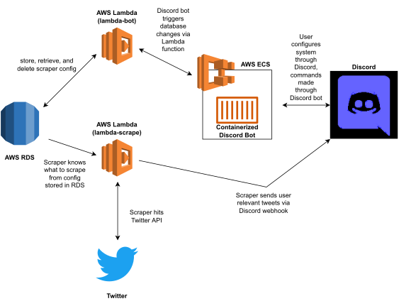

# Waluigi
A Discord bot which posts alerts based on the posts of Twitter user Wario64

### Who Is Wario64
[Wario64](https://twitter.com/Wario64) is a long-running Twitter account which posts deals and availability for video games, video game consoles, and other nerd-adjacent paraphenalia. They (the account runner or runners are anonymous, thus I will use "they" to refer to them) are one of the leading aggregators for sales information in video games, and are considered a valuable resource for people looking to snag deals, including helping people obtain Xbox Series Xs and Playstation 5s through supply shortages which began due to the COVID-19 pandemic (in a bleakly comedic moment, they also [assisted people in finding vaccination appointments](https://twitter.com/wario64/status/1384987791398825987) during the initial COVID-19 vaccine rollout).

### Why Does This Bot Exist
Wario64 primarily disseminates information through Twitter. Because of this, their feed is a continuous stream of all available deals, each of which may or may not be of interest to a given person, and are also subject to the strange and blackboxed algorithm by which Twitter displays tweets of a given account you follow, meaning you either have to risk missing a relevant tweet because it just got lost in your feed or Twitter simply did not show it to you, or opting into notifications for the account and being bombarded sometimes dozens of times a day with tweets for deals for everything from Playstation 5s to anime figures to [a cookbook themed after the movie Alien](https://twitter.com/Wario64/status/1433522076137115648), an object whose existence confuses me more than any computational geometry algorithm.

Thus, this bot was designed as a project to filter Wario64's feed for items of personal interest, forwarding relevant tweets of theirs to a quieter feed of information personalized to the user(s). Due to it becoming my main social network of choice nowadays, and the ease of use of programming for it, I elected to forward this information to a Discord bot, which will post Wario64's tweet to a private server for which I can get notifications. This bot then also uses Discord as a UI, allowing the user to do things like add and remove key terms from the filter the bot uses to select relevant Wario64 tweets.

### Limitations
This bot runs hourly (based on a cron job), pulling recent tweets from Wario64's feed, meaning that if any particular deal has a lifetime of less than an hour, or sells out in less than an hour, there's a chance that by the time the bot wakes up and checks for new tweets, the deal will already have run out. This makes it unsuitable for searching for things like a Playstation 5 or an RTX 3080 (both of which notoriously sell out in a matter of minutes), but A) I don't really need a Playstation 5 or a 3080 right now, and B) there are literally countless other Discord bots that are better suited for that.

### Architecture

Four primary components comprise the architecture of Waluigi.

The user interface for the bot is a user-hosted or -managed Discord channel, ideally one they have administrator priveleges to. A Discord bot, written in Python 3.10 and hosted in ECS as a Dockerized application, which for simplicity I will also call "Waluigi", sits in this server and recieves commands from the user via text prefixed with keywords (a list of bot keywords and their functionality can be found below). Through this bot, the user registers their server with the application, sets what terms they want to recieve deals for, etc.

It should be noted that the actual posting of Wario64 tweets to this channel is _not_ done by the bot itself. Instead, the bot sets up a Discord webhook which is then passed through the entire system and is eventually used by lambda-scrape to post Tweets it finds. This is largely due to the way Discord bots are designed, as trying to get one to post as a result of a stimuli outside of the actual Discord channel (such as a timer or tweets), is a fairly large annoyance.

All configuration changes made by this Discord bot are sent via API call to the first of two AWS Lambda functions, lambda-bot, a Python 3.9 Flask application deployed to Lambda via Zappa. lambda-bot is designed to manage all of the requests from the Discord bot, mostly in the form of creating, updating, and deleting records in a MySQL database running in RDS which manages all configuration for Waluigi across all servers.

A second AWS Lambda called lambda-scrape, also a Python 3.9 application deployed to Lambda, handles the actual act of scraping. Upon wakeup, it pulls from the RDS instance to determine what search terms to search for, as well as where to send the results. A bit of intelligent joining done during this ensures that if multiple servers with Waluigi request the same search term, only one search is done, with the results being sent to multiple servers. lamdba-scrape then uses the Twitter API to perform searches for relevant terms (relevant here being "asked for by one or more Waluigi users") from Wario64 since last wakeup, collates those results, and then sends them to the appropriate Discord servers via webhook.